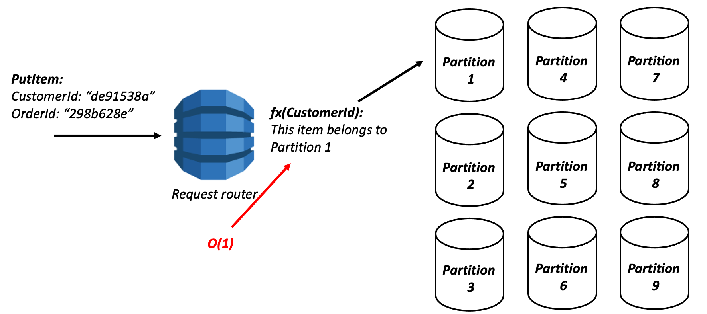

## dynamodb 101

As per AWS DynamoDB docs,

> NoSQL database systems like Amazon DynamoDB use alternative models for data management, such as key-value pairs or document storage. When you switch from a relational database management system to a NoSQL database system like DynamoDB, it's important to understand the key differences and specific design approaches.

### some dynamodb basics:

- **partitions**
    
    https://www.alexdebrie.com/posts/dynamodb-partitions/

    Horizontal scaling using partition key
     `fx` means hash function for partition key

    > Cassandra uses similar partition concept but their client can do the hashing and choose which partition to save the data.

- **partition key**

  The primary key that uniquely identifies each item in an Amazon DynamoDB table can be simple (a partition key only) or composite (a partition key combined with a sort key).
  Also known as its hash attribute. The term "hash attribute" derives from the DynamoDB usage of an internal hash function to evenly distribute data items across partitions, based on their partition key values.

- **sort key** :point_up:

  The sort key of an item is also known as its range attribute. The term "range attribute" derives from the way DynamoDB stores items with the same partition key physically close together, in sorted order by the sort key value.

- **indexes**
  - primary
  - secondary - LSI and GSI

  ### resources:

- https://explore.skillbuilder.aws/learn/signin  - dynamoDb course

- https://www.alexdebrie.com/ Alex Debrie blog

- https://www.dynamodbbook.com/ - some chapters of book are free 

- https://dynobase.com/dynamodb-cli-query-examples/ - dynamboDb cli examples
